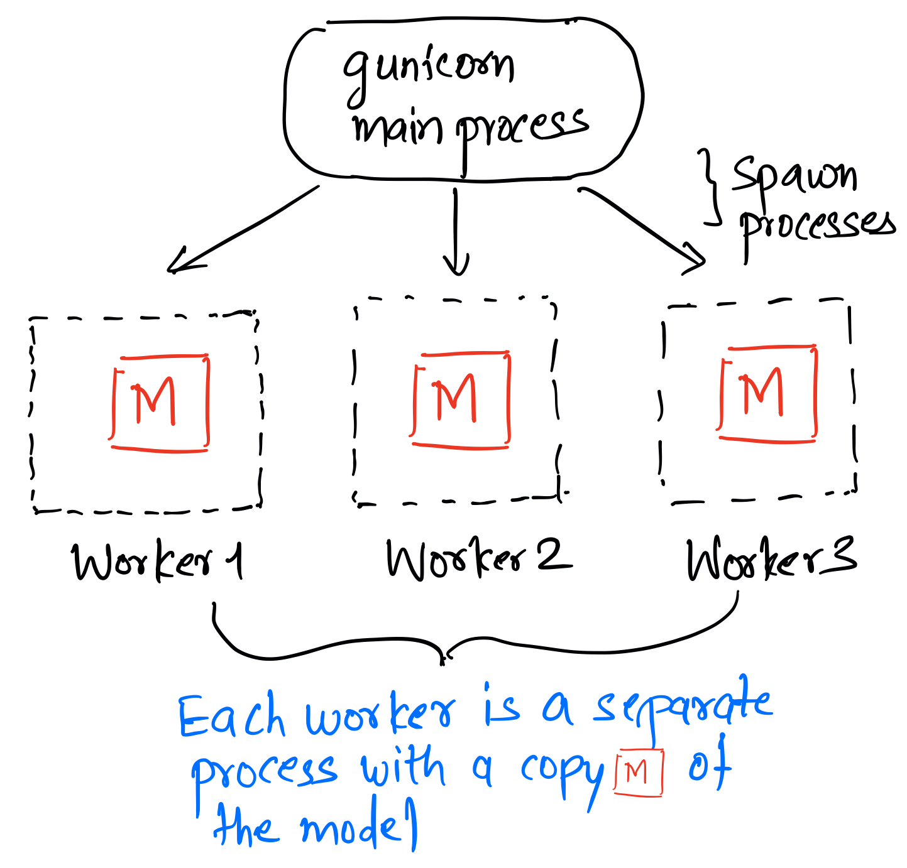
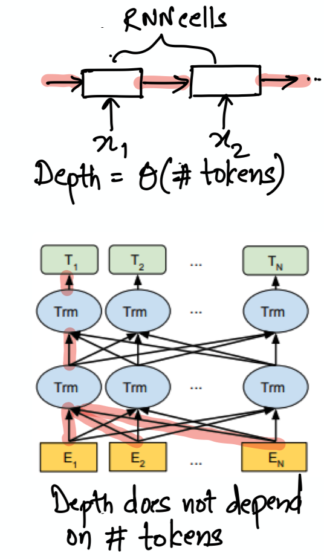

## Model serving: important for business but less focus from  academicians
Machine Learning powers key customer facing recommendations as well as back-end decisions at most consumer internet and e-commerce companies. For the customer, in addition to the accuracy of predictions the latency is also critical. 

[A recent study at Akamai found that a 100 millisecond increase in latency leads to 7% reduction in conversion rates](https://www.akamai.com/uk/en/about/news/press/2017-press/akamai-releases-spring-2017-state-of-online-retail-performance-report.jsp)

Academicians have worked extensively on aspects like optimization, designing newer architectures etc. Their efforts have led to significant leaps in solving real world tasks like Image Classification and NLP tasks like machine translation. However, the academic community has largely overlooked the model serving aspects. A notable exception is the [RISELab](https://rise.cs.berkeley.edu/) at Berkeley and its predecessor the AMPLab which led to the hugely popular open source framework Spark. Unlike model training, model serving is therefore a topic for which no textbooks are available. I will hence attempt to provide a practitioners' view of model serving and the challenges that we face in the real world.

Inline-style: 

## Challenges in deploying and serving predictions
### 1. Python's GIL leads to inefficiencies even on single node deployments
Most data scientists are comfortable with Python and like to deploy their trained models in a framework like flask which is a lightweight and popular framework for serving applications. A typical the setup consists of flask, gunicorn and a reverse proxy like nginx. While this setup supports concurrency, ML workloads are CPU bound.

Constraints due to Python's GIL. Even in the simplest of architectures where one wishes to deploy the model on a single node, relying on the typical setup above forces use of multiple processes each having a copy of the model in memory. It's not unusual for a DL model to occupy 500–700 GB in memory. This strategy clearly is inefficient since there's no real need for multiple copies to be held in memory since the same serving pattern can be implemented using multithreading in a language like C++. (Astute readers would say "there are other patterns where the GIL can be released" and so on but I won't cover that in this article.)

### 2. Awareness about the compute DAG induced by ML architectures
This problem tends to happen in companies where bulk of the work is on converting existing off-the shelf popular models to prediction APIs. ML experts might not be part of the team and hence the ML model itself is treated like a black-box by the engineering team. Not being aware of the internal compute DAG of the model means that the team has little control over the latency of prediction.

One of the most illustrative examples is RNNs vs the BERT architecture. Assume the task is to predict a single next token given a sequence of tokens. For this task, the compute DAG (shaded red) for the RNN has a depth ~ # tokens in the input. For the BERT model however this depth does not depend on # tokens (see the edges shaded in red again). **If you are not limited by processing power then using BERT might give you better prediction latency for very long inputs** 
